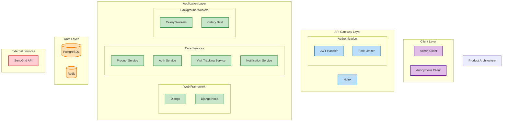

# Architecture Overview

The Product Watch system follows a layered architecture pattern with clear separation of concerns.

## High-Level Architecture Diagram

## Key Components

### Client Layer
- **Admin Client**: Interface for authenticated admin users to manage products and view analytics
- **Anonymous Client**: Public interface for unauthenticated users to view products

### API Gateway Layer
- **Nginx**: Front-facing reverse proxy for request routing and SSL termination
- **JWT Handler**: Manages JSON Web Token based authentication
- **Rate Limiter**: Throttles requests to prevent abuse

### Application Layer
- **Django**: Python web framework serving as the foundation
- **Django Ninja**: Library for building API endpoints
- **Product Service**: Handles CRUD operations for products
- **Auth Service**: Manages user registration, login, and token handling
- **Visit Tracking Service**: Tracks anonymous user visits to products
- **Notification Service**: Sends email notifications for product updates
- **Celery**: Distributed task queue for asynchronous processing
- **Celery Beat**: Schedules periodic tasks like daily analytics reports

### Data Layer
- **PostgreSQL**: Primary relational database for storing application data
- **Redis**: In-memory data store for caching, rate limiting, and async task brokering

### External Services
- **SendGrid API**: Third-party service for sending transactional emails

## Request Flow

1. Client sends request to Nginx
2. Nginx routes request to Django Ninja API
3. JWT Handler middleware authenticates request
4. Rate Limiter middleware checks against throttling rules
5. Request reaches appropriate API endpoint
6. Endpoint invokes methods on Services to fulfill request
   - Services interact with Postgres and Redis to query and persist data
7. For async tasks (e.g. email notifications), Service dispatches tasks to Celery queue
   - Celery workers process tasks asynchronously
   - Celery Beat schedules periodic tasks
8. API forms response and sends back to client