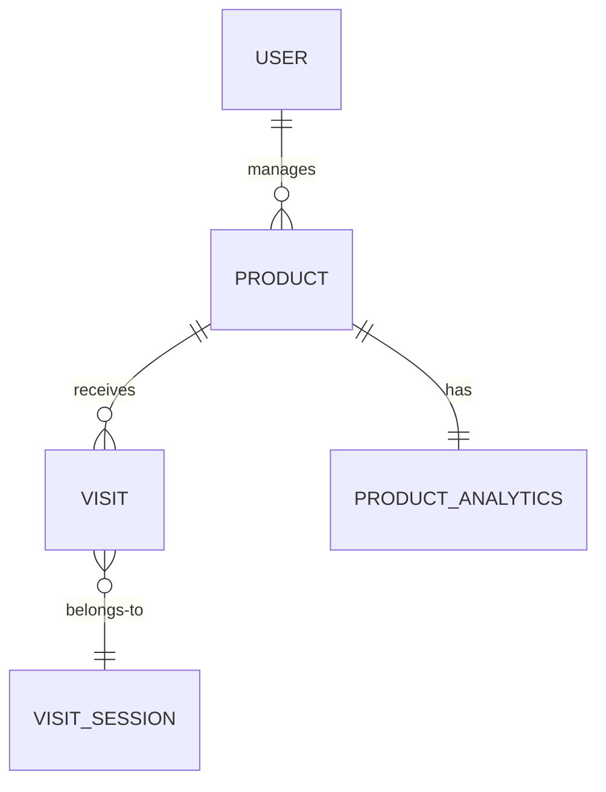

# Database Schema

The system uses PostgreSQL as the primary database. Here are the key tables and their fields:

## Products
```sql
CREATE TABLE products (
    id UUID PRIMARY KEY DEFAULT uuid_generate_v4(),
    name VARCHAR(255) NOT NULL,
    description TEXT,
    price DECIMAL(10,2) NOT NULL,
    stock INTEGER NOT NULL,
    created_at TIMESTAMP WITH TIME ZONE DEFAULT NOW(),
    updated_at TIMESTAMP WITH TIME ZONE DEFAULT NOW()
);
```

The `products` table stores the core product catalog data. 
- `id` is a auto-generated UUID primary key
- `name`, `price`, and `stock` are required fields
- `description` is optional text for product details
- `created_at` and `updated_at` are timestamps managed automatically

## Visits
```sql  
CREATE TABLE visits (
    id UUID PRIMARY KEY DEFAULT uuid_generate_v4(),
    product_id UUID NOT NULL REFERENCES products(id),
    ip_hash VARCHAR(64) NOT NULL,
    user_agent TEXT,
    session_id VARCHAR(36),
    timestamp TIMESTAMP WITH TIME ZONE DEFAULT NOW(),
    duration INTEGER
);
```

The `visits` table stores individual visits to product pages.
- `id` is an auto-generated UUID primary key
- `product_id` is a foreign key referencing the associated product
- `ip_hash` is a hashed version of the visitor's IP for anonymity 
- `user_agent` is optionally captured to identify client device/browser
- `session_id` ties visits to an anonymous session (stored in a cookie)
- `timestamp` captures the visit time 
- `duration` optionally measures time spent on page in seconds

## Visit Sessions
```sql
CREATE TABLE visit_sessions (
    session_id VARCHAR(36) PRIMARY KEY,
    first_visit_time TIMESTAMP WITH TIME ZONE,
    last_visit_time TIMESTAMP WITH TIME ZONE,
    visit_count INTEGER DEFAULT 1
);
```

The `visit_sessions` table aggregates visits into sessions.
- `session_id` is a UUID identifying the session (stored in user's cookie)
- `first_visit_time` and `last_visit_time` track session start and end  
- `visit_count` tallies total visits in the session (across products)

## Product Analytics
```sql
CREATE TABLE product_analytics (
    product_id UUID PRIMARY KEY REFERENCES products(id),
    total_visits BIGINT DEFAULT 0,
    unique_visitors BIGINT DEFAULT 0,  
    avg_duration INTEGER,
    last_updated TIMESTAMP WITH TIME ZONE,
    daily_stats JSONB
);
```

The `product_analytics` table aggregates `visits` data to the product level.
- `product_id` is the primary key referencing the associated product
- `total_visits` counts total visits to the product
- `unique_visitors` counts distinct visitor IPs 
- `avg_duration` averages the `duration` of visits
- `last_updated` timestamps the last aggregation update
- `daily_stats` stores a JSON object with per-day visit stats

## Users
```sql
CREATE TABLE users (
    id UUID PRIMARY KEY DEFAULT uuid_generate_v4(),
    email VARCHAR(255) UNIQUE NOT NULL,
    password_hash VARCHAR(255) NOT NULL,
    is_admin BOOLEAN DEFAULT FALSE,
    created_at TIMESTAMP WITH TIME ZONE DEFAULT NOW(),  
    last_login TIMESTAMP WITH TIME ZONE
);
```

The `users` table stores application user accounts.
- `id` is an auto-generated UUID primary key  
- `email` is the unique login identifier
- `password_hash` securely stores the hashed password
- `is_admin` designates the user's role (admin or normal)
- `created_at` timestamps the user's registration
- `last_login` tracks the most recent login time

## Indexes

To optimize query performance, we create the following indexes:

```sql
-- Indexes on products table
CREATE INDEX idx_products_name ON products USING btree (name);

-- Indexes on visits table  
CREATE INDEX idx_visits_product_id ON visits USING btree (product_id);
CREATE INDEX idx_visits_session_id ON visits USING btree (session_id);
CREATE INDEX idx_visits_timestamp ON visits USING btree (timestamp);

-- Indexes on users table
CREATE UNIQUE INDEX idx_users_email ON users USING btree (email);
CREATE INDEX idx_users_last_login ON users USING btree (last_login);
```

Key points:
- `idx_products_name` optimizes searches by product name
- `idx_visits_product_id` speeds up analytics aggregation
- `idx_visits_session_id` and `idx_visits_timestamp` help with session-based analysis
- `idx_users_email` enforces uniqueness and speeds up auth checks
- `idx_users_last_login` allows quick lookups of recent activity

## Entity Relationship Diagram



The key relationships are:
- `PRODUCT` to `VISIT` is one-to-many (a product has many visits)
- `PRODUCT` to `PRODUCT_ANALYTICS` is one-to-one (analytics roll up to product)
- `VISIT` to `VISIT_SESSION` is many-to-one (visits are grouped into sessions)
- `USER` to `PRODUCT` is many-to-many (admins can manage many products)