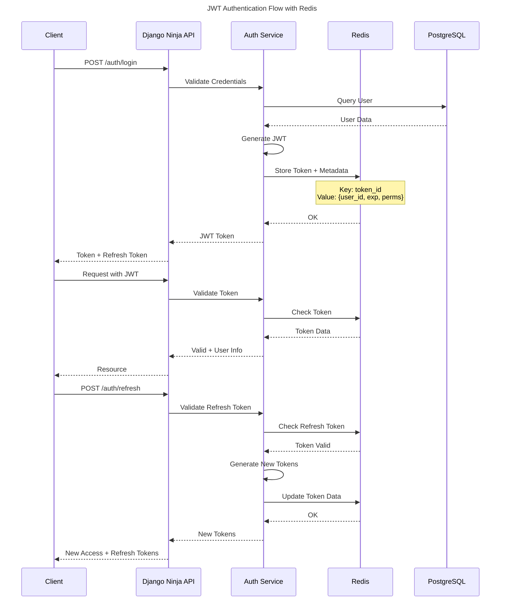

# JWT Authentication Flow

The system uses JSON Web Tokens (JWT) to handle user authentication and authorization.

## Sequence Diagram

## Authentication Flow

1. Client sends credentials to `/auth/login` endpoint
2. Auth Service validates credentials against database
3. Auth Service generates JWT with user ID and permissions
4. Auth Service stores token metadata in Redis with expiration
5. API returns JWT and refresh token to client

## Authorization Flow

1. Client sends request with JWT in Authorization header
2. API passes JWT to Auth Service for validation
3. Auth Service checks token metadata in Redis
   - Verifies token hasn't expired
   - Retrieves user ID and permissions
4. If valid, Auth Service attaches User to request
5. API can check user's permissions to authorize access to resources

## Token Refresh Flow
1. Client sends refresh token to `/auth/refresh` endpoint
2. Auth Service validates refresh token against Redis
3. If valid, Auth Service generates new access and refresh tokens
4. Auth Service updates token metadata in Redis
5. API returns new tokens to client

## Key Components
- **Auth Service**: Handles credential validation, token generation and validation
  - `create_access_token`: Generates JWT access token with user data
  - `create_refresh_token`: Generates JWT refresh token 
  - `verify_token`: Checks validity of access token against Redis
  - `verify_refresh_token`: Checks validity of refresh token against Redis
  - `invalidate_tokens`: Revokes all tokens for a user
- **Redis**: Stores token metadata with expiration for quick validation
  - Access tokens stored with hash of metadata
  - Refresh tokens stored with token string
- **JWT Handler**: Class encapsulating logic for JWT creation and validation
  - Accepts algorithm and expiration settings from environment
  - Provides methods to generate and verify tokens
- **Auth Dependencies**: Provides auth dependency to attach to routes
  - `AuthBearer`: Extracts JWT from header, invokes verification, attaches User to request
  - Configurable to require admin role