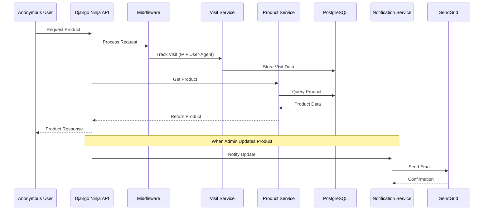

# Visit Tracking Flow

The system tracks visits from anonymous users to product pages to gather analytics and popularity data.

## Sequence Diagram

## Flow Steps
1. Anonymous User requests a Product page
2. Middleware intercepts request before it reaches API
3. Middleware extracts IP address and User-Agent and passes to Visit Service
4. Visit Service hashes IP for anonymity and stores Visit record in database
5. Request proceeds to Product Service
6. Product Service queries database for Product data
7. Product data is returned via API to user
8. When an Admin updates a Product:
   - API dispatches async notification to Notification Service
   - Notification Service sends update email via SendGrid
   - SendGrid confirms email queued for delivery

## Key Components

- **Middleware**: Custom middleware class to intercept requests and initiate visit tracking
- **Visit Service**: Handles persistence of Visit records and shields PII via hashing
  - `track_visit`: Accepts IP and User-Agent, hashes IP, and stores Visit
  - `update_analytics`: Aggregates visit data into Product-level analytics
- **Notification Service**: Receives async message to send email notifications
- **SendGrid**: External API to deliver transactional email

## Analytics Aggregation
The `update_analytics` method in Visit Service periodically aggregates granular Visit data into ProductAnalytics records. This pre-aggregation enables efficient querying of product-level metrics.

Key metrics aggregated:
- Total visits
- Unique visitors (based on hashed IP)
- Average visit duration 
- Daily visit stats

Aggregation is triggered asynchronously after visits and on a regular schedule via Celery Beat.